# Final whole-branch review fix wave

_Worktree `C:\Users\Melodrama\pjsk-planner\.worktrees\ui-system-normalization` · branch `codex/ui-system-normalization` · fix base `ce7f797f60edfed6356781a4cd9e73ec0af9bfe3` · 2026-09-17_

---

## 📋 Outcome

The two Important review findings are fixed and committed in `9ceb6f1d5ff2044b03675d9324c2d5656b744d77` (`fix: enforce liquid glass ownership and contract invariants`). The regular Event History and Predict shells are now the only covered backdrop-filter owners, and explicit style-contract updates reject invariant or bounding-box drift while permitting only `backgroundImage` and `boxShadow` changes.

```mermaid
flowchart LR
    accTitle: Final review fix flow
    accDescr: The review fixes moved from failing unit and rendered-contract evidence through minimal production changes to the complete verification gate.

    red([🔴 RED evidence]) --> tdd[🧪 TDD implementation]
    tdd --> green[🟢 Focused GREEN checks]
    green --> verify[🔍 Full verification]
    verify --> commit([✅ Commit 9ceb6f1])

    classDef start fill:#fee2e2,stroke:#dc2626,stroke-width:2px,color:#7f1d1d
    classDef process fill:#dbeafe,stroke:#2563eb,stroke-width:2px,color:#1e3a5f
    classDef success fill:#dcfce7,stroke:#16a34a,stroke-width:2px,color:#14532d

    class red start
    class tdd,green,verify process
    class commit success
```

## 🎯 RED evidence

### Style-contract unit tests

After converting the inherited radius-overwrite assertion to the required invariant-safe behavior and adding the focused material/sibling case, the pre-production run was:

| Command | Outcome |
| --- | --- |
| `node --test src/utils/styleContract.test.js` | **4 passed, 4 failed** (8 total) |

The four failures were the expected missing rejection/deep-merge behaviors: existing radius, omitted invariant siblings, existing font metrics, and bounding-box changes. The original inherited run before that test adjustment also showed the two missing rejection failures (5 passed, 2 failed of 7).

### Rendered shell ownership

`npm.cmd run test:visual -- --grep "regular Event History and Predict shells own filtering" --reporter=line --output $redOutput` failed as expected before the production CSS changes:

- Event History normal descendant 0 expected `backdrop-filter: none`
- Received `saturate(1.65) blur(14px)` from the nested `.nav-btn`/`.sort-btn` material

The trace and error context were written outside the worktree under `%TEMP%\pjsk-final-fix-red`; the required untracked `test-results/` directory was not used.

## 🔧 Implementation summary

### Regular shell ownership

- `src/components/EventHistory.vue` removes local filters from `.nav-btn`, `.sort-btn`, `.char-chip`, `.icon-group.attributes img`, and `.icon-group.units img`.
- `src/components/PredictEditor.vue` removes local filters from `.close-btn`, `.global-config-bar`, `.cfg-group`, `.cfg-group select`, `.editor-card`, `.mini-select`, `.unit-tag`, and `.empty-hint`.
- Existing fills, borders, shadows, state styles, dimensions, DOM structure, interactions, breakpoints, and exports remain unchanged. The root `.filter-bar`, `.filter-panel`, and `.predict-drawer` retain their centralized `ui-liquid-glass--regular` material and fallback behavior.

### Invariant-safe style-contract updates

- `src/utils/styleContract.js` now recursively merges focused collected entries into the complete baseline.
- Only leaves named `backgroundImage` and `boxShadow` may overwrite an existing baseline value.
- Existing invariant values, including nested `boundingBox` fields, are compared recursively and rejected with the exact path, baseline value, collected value, and the permitted update rule.
- An absent baseline still accepts the collected contract, preserving initial baseline creation.
- The visual runner continues to write only when `testInfo.config.updateSnapshots === 'all'`; ordinary snapshot modes remain read-only.

### Test coverage

- `src/utils/styleContract.test.js` covers material updates, omitted invariant preservation, invariant rejection, bounding-box rejection, and initial baseline creation.
- `tests/visual/ui.visual.spec.mjs` covers Event History and Predict shell ownership in refractive, opaque, and reduced-motion fallback modes. The helper normalizes Chromium's absent `webkitBackdropFilter` property to the semantic value `none` without adding a production declaration.

## ✅ Verification commands and outcomes

| Command | Outcome |
| --- | --- |
| `node --test src/utils/styleContract.test.js` | 8/8 passed |
| `npm.cmd run test:unit` | 64/64 passed; exit 0 |
| `npm.cmd run check:ui` | `UI policy check passed`; exit 0 |
| `npm.cmd run build` | Vite 7.3.1; 90 modules transformed; exit 0 |
| Focused rendered contract with `--grep "regular Event History and Predict shells own filtering"` | 1/1 passed after the vendor-property normalization |
| `npm.cmd run test:visual -- --reporter=line --output $visualOutput` | 40/40 passed in 6.9 minutes |
| `git diff --check ce7f797f60edfed6356781a4cd9e73ec0af9bfe3..HEAD` | exit 0 |

The full visual run used a temporary output directory outside the worktree. The in-worktree untracked `test-results/.last-run.json` remains present with its original content (`status: passed`, `failedTests: []`) and was never staged or committed.

## 📦 Files and commit

### Committed files

| File | Purpose |
| --- | --- |
| `src/components/EventHistory.vue` | Remove nested regular-shell descendant filters |
| `src/components/PredictEditor.vue` | Remove nested drawer control/card filters |
| `src/utils/styleContract.js` | Enforce material-only explicit contract updates |
| `src/utils/styleContract.test.js` | Unit/contract TDD coverage |
| `tests/visual/ui.visual.spec.mjs` | Rendered normal/fallback ownership coverage |

Commit: `9ceb6f1d5ff2044b03675d9324c2d5656b744d77`

The report itself is written at `.superpowers/sdd/2026-09-14-liquid-glass-redesign/final-review-fix-report.md`. The separate untracked `test-results/` directory is intentionally excluded from the commit.

## 🔐 Export and contract integrity

The export-named visual artifacts were compared with `git hash-object` against the fix base. Every listed base/current SHA-1 pair is identical, and `tests/visual/style-contract.json` has no change.

| Artifact | Base SHA-1 | Current SHA-1 |
| --- | --- | --- |
| `tests/visual/__screenshots__/card-panel-export.png` | `54ac360f8cb7bfef74dd32f3e484978d210be8c0` | `54ac360f8cb7bfef74dd32f3e484978d210be8c0` |
| `tests/visual/__screenshots__/history-predicted-export.png` | `b28851796ff7c2343a91c65026eaac9f51df59aa` | `b28851796ff7c2343a91c65026eaac9f51df59aa` |
| `tests/visual/__screenshots__/liquid-glass-card-stats-1200-export-boundary.png` | `697686382c12030de46963f1a7f9c530a70bb930` | `697686382c12030de46963f1a7f9c530a70bb930` |
| `tests/visual/__screenshots__/song-anvo-fill-export.png` | `6d70bef636419e0458d02110af178758f1564381` | `6d70bef636419e0458d02110af178758f1564381` |
| `tests/visual/__screenshots__/song-anvo-image-export.png` | `324691ad3b19800afe0f28ee9f155b7df34ae36b` | `324691ad3b19800afe0f28ee9f155b7df34ae36b` |
| `tests/visual/__screenshots__/special-predict-export.png` | `86fffc6d9595e8f2171ac4831fef223a0676b67b` | `86fffc6d9595e8f2171ac4831fef223a0676b67b` |
| `tests/visual/exports.visual.spec.mjs` | `f02fea0acc3d02f61f9db9927ea00c1075ff6469` | `f02fea0acc3d02f61f9db9927ea00c1075ff6469` |

No `--update-snapshots` run was used, and no invariant style-contract field or bounding-box value was accepted as changed.

## ⚠️ Concerns

- The Playwright/npm processes emitted the existing benign `NO_COLOR`/`FORCE_COLOR` warning; all affected commands exited successfully.
- `test-results/.last-run.json` remains intentionally untracked and must stay outside future staging operations.
- No remaining product, layout, responsive, export, or verification concern was observed.
